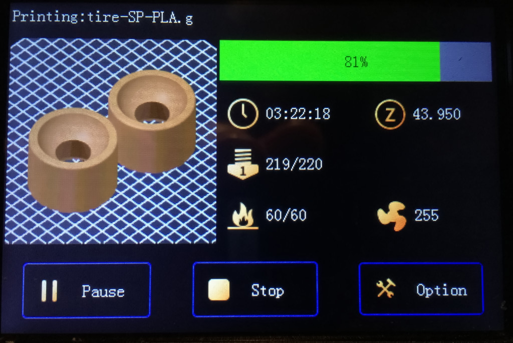
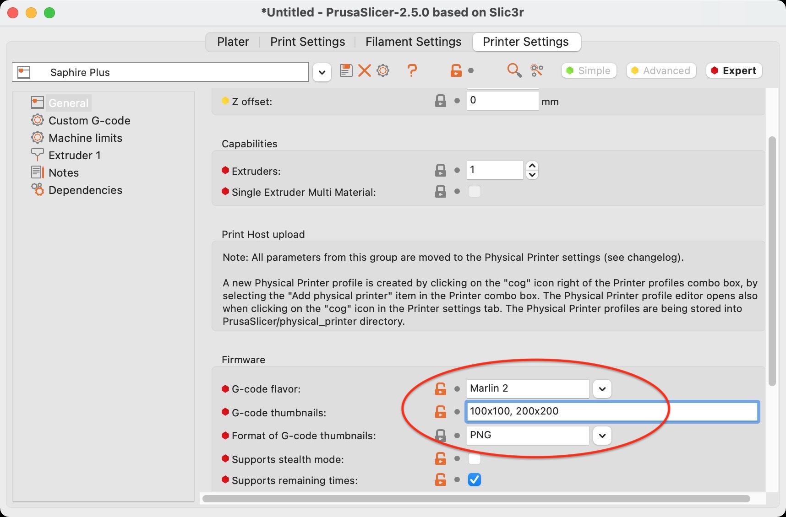
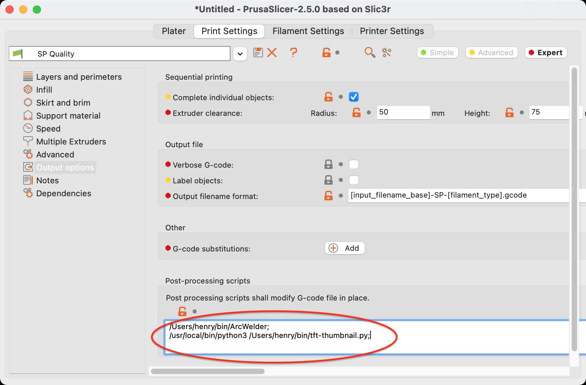

Copied from this repository https://github.com/whpthomas/tft-thumbnail but with changes to remove Windows line endings(CR-LF) to make the preview show properly on the TwoTrees Bluer printer with the MKS Robin nano v1.2 board and with the TFT35.

I'm adding a copy of the origial read me but with the paths changed for windows because i'm lazy the windows parts start with an <ins>underline</ins>.

# TFT Thumbnail

**tft-thumbnail** is a Prusa Slicer post processor for Two Trees Sapphire Pro/Plus (and MKS Robin Nano TFT35) 3D printers for generating compatible preview images.

## Installation

Download the `tft-thumbnail.py` file and place it in your scripts folder. I use `~/bin` for this.

<ins>On Windows</ins> I created a scripts folder in a folder that doesn't need admin privileges ex. ('C:\Users\[your username]\Documents\PrusaScripts')

You will also need to make sure you have python3 installed and configured. On my Mac that can be done at the command prompt with:

`brew install python3`

<ins>On windows</ins> download you can download python on the original site this is the version i used 'https://www.python.org/downloads/release/python-3113/' or use a utility like chocolatey to install the python version 3.11.3

Then I recommend you run this post processing script at the command prompt on a small G-code file to check that all the required python libraries are installed. For example:

`python3 tft-thumbnail.py test.gcode test-sp.gcode`

<ins>On Windows</ins> I used 

`"[PATH TO PYTHON]\python.exe" "[PATH TO SCRIPTS]\tft-thumbnail.py" "[PATH TO GCODE]\test.gcode" "[PATH TO GCODE]\test-sp.gcode"`

If you see any errors you can use `pip` to install any missing modules. For example:

`pip install regex`

`pip install Image`

<ins>On Windows</ins> You may need to use a command prompt with admin privileges

## Prusa Slicer Setup

You need to configure Prusa Slicer to output preview images (G-code Thumbnails) and then run this post processing script to convert them into a format compatible with the MKS Robin Nano TFT35 display used by the Sapphire Pro/Plus 3D printers.

Under the **Printer Settings** tab, in **Firmware** settings:

* G-code flavor: **Marlin 2**
* G-code thumbnails: **100x100, 200x200**
* Format of G-code thumbnails: **PNG**

Under the **Print Settings** tab, in **Post-processing scripts** settings:

`/path/to/python3 /path/to/tft-thumbnail.py`

<ins>On Windows</ins> I used 

`"[PATH TO PYTHON]\python.exe" "[PATH TO SCRIPTS]\tft-thumbnail.py"`
